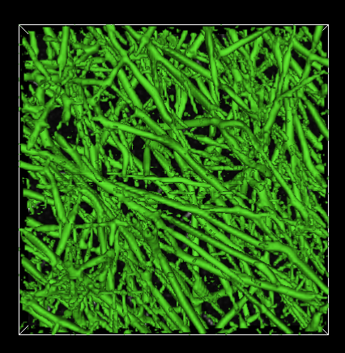

# NetworkExtractor

Network Extractor is a program for segmenting and collecting statistics on fibrous objects in 3D images. It has been developed with the specific target of fibrin network images in mind, but can be applied to images of any kind of fibrous object such as collagen or actin networks, for example.

See docs directory for more information.

## Acknowledgments
Network Extractor is developed and maintained by the Center for Computer Integrated Systems for Microscopy and Manipulation, a National Institute of Biomedical Imaging and Bioengineering Resource, award number P41-EB002025.

## Legalese
The Network Extractor is FREE to download, install, and use, and is distributed in the hope that it will be useful, but WITHOUT ANY WARRANTY, without even the implied warranty of MERCHANTABILITY or FITNESS FOR A PARTICULAR PURPOSE.

